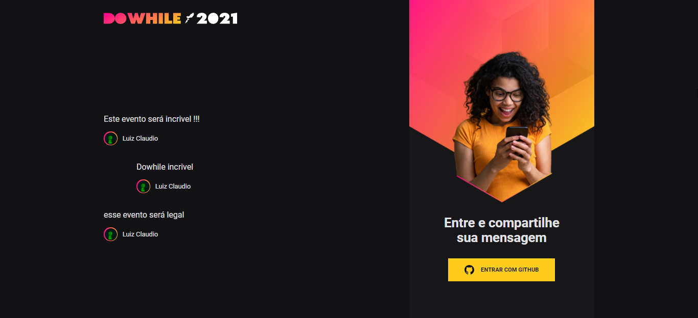
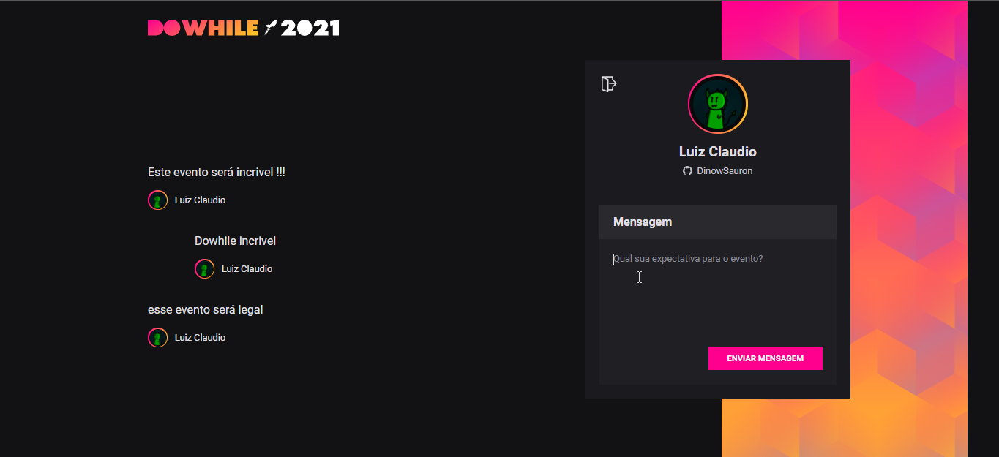
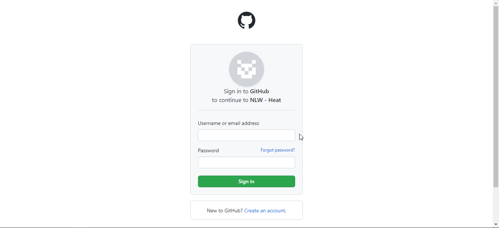
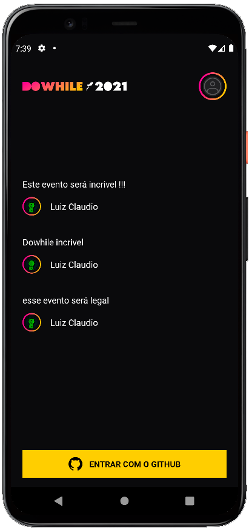
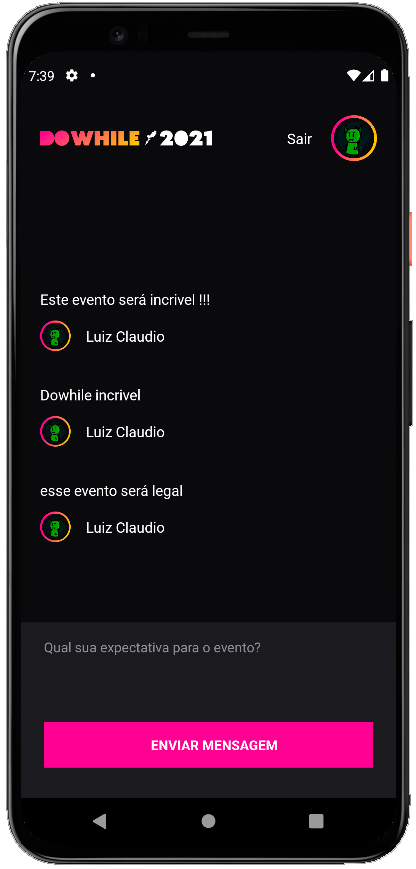
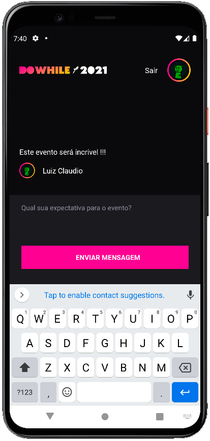
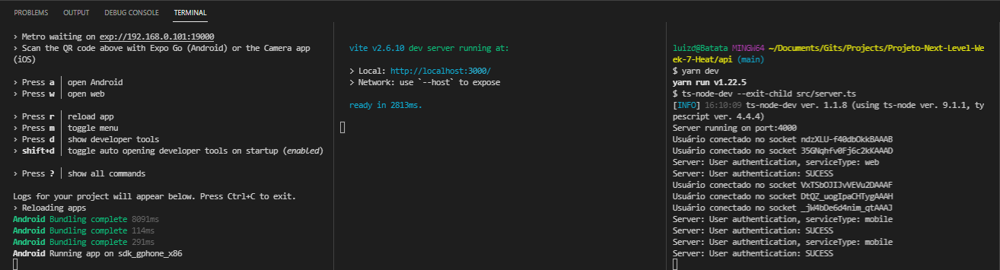

# Projeto-Next-Level-Week-7-Heat

<a href="https://github.com/DinowSauron/Projeto-Next-Level-Week-6-Together" title="letmeask" >
    <p align="center">
        
    </p>
</a>


<p align="center">
  <a href="#Aula REACT JS">React</a>&nbsp;&nbsp;&nbsp;|&nbsp;&nbsp;&nbsp;
  <a href="#Aula React Native">React Native</a>&nbsp;&nbsp;&nbsp;|&nbsp;&nbsp;&nbsp;
  <a href="#Aula NODE JS">Node JS</a>&nbsp;&nbsp;&nbsp;|&nbsp;&nbsp;&nbsp;
  <a href="#Aula Elixir">Elixir</a>&nbsp;&nbsp;&nbsp;|&nbsp;&nbsp;&nbsp;
  <a href="/LICENSE">Licença</a>
</p>


O Projeto da **[Next Level Week](https://nextlevelweek.com/)** desta semana foi criar um sistema onde os usuarios podem dizer suas espectativas para o evento chamado DoWhile feito pela **[@Rocketseat](https://github.com/Rocketseat)** 


## Fotos Da Aplicação:

<a href="https://github.com/DinowSauron/Projeto-Next-Level-Week-7-Heat" target="_blank">
    
    <p style="display: flex; margin-top: 20px" >
        
        
    </p>
    <p style="display: flex; margin-top: 20px">
        
        
        
    </p>  
    
</a>

---


## Novidades:
* Da forma como foi criado por min, o mesmo servidor pode ser lidado para as chamadas web e as mobile, sendo mais eficiente que o servidor do evento, onde é necessário um servidor para cada plataforma!!

ctrl + shift + p > reload window.

Ao criar seu type personalizado, coloque a propiedade ``"typeRoots": ["./src/@types", "node_modules/@types"]`` no ts.config


## Tecnologias Utilizadas:

* Node JS
* Typescript
* React
* React Native
    * Expo cli
* Elixir
    * Phoenix
    * Postgres db
* Vite - Fast Refresh(ts, jsx, css, webpack);
* Gihub Oauth
* Web Sockets
* Sqlite db
* Prisma

<br/><br/>


# Como Inicializar:

Lembrando que para você executar as aplicação necessita ter o Node.js instalado em sua maquina!

### .Env Vars:
é necessário criar 2 app no github auth, um para o mobile e outro para a web, mais o servidor é o mesmo entre os dois, pois eu configurei para que funcionasse como um 'cross-platform'

```.env 
// Api .env
GITHUB_WEB_CLIENT_SECRET=...(private)
GITHUB_WEB_CLIENT_ID=...

GITHUB_MOBILE_CLIENT_SECRET=...(private)
GITHUB_MOBILE_CLIENT_ID=...

JWT_SECRET=_aleatory_key_md5(private)
```
```.env
// Web .env
VITE_GITHUB_WEB_CLIENT_ID=...(public)
```
```js
// Mobile env.js
// Note que este é um arquivo .js pois a variavel será publica.

const CLIENT_ID = '...(public)'

module.exports = {
    CLIENT_ID,
} 
```

## Execução de comandos:
* Abra 3 terminal.
* ``ls`` - verifique as pastas.
---
### API
* ``cd api`` - Entra no diretorio.
* ``yarn install`` - Instala dependências.
* ``yarn prisma migrate dev`` - realizar migrações no banco de dados.
* ``yarn dev`` - Inicia. 
---
### React
* ``cd web`` - Entra no diretorio .
* ``yarn install`` - Instala dependências.
* ``yarn dev`` - Inicia.
---
### React Native
* ``cd mobile`` - Entra no diretorio .
* vá em ``./src/services/api.ts`` e mude para seu ipv4 local ``ipconfig`` para verificar o seu ipv4.
* ``yarn install`` - Instala dependências.
* ``expo start`` - Inicia. 


<br/><br/>

# Aula REACT JS

A novidade desta aula para min foram os websockets, que permitem uma conecção de dados em tempo real com o servidor


## Comandos utilizados:

* ``yarn create vite web --template react-ts`` - cria o projeto vite
* ``cd web`` - entra no diretorio front-end
* ``yarn`` - instala os pacotes
* ``yarn add sass -D`` - instala o sass
* ``yarn add react-icons`` - adiciona icones no react
* ``yarn add axios`` - cliente de requisições http (tipo express, cria e gerencia rotas)
* redirecionar ocallback da aplicação para ``http://localhost:300`` ao invés de ``http://localhost:4000/signin/callback``
* ``yarn add socket.io-client`` - WebSockets (comunicação em tempo-real com backend)


<br/><br/>

# Aula React Native

* necessita de um emulador ou o expo instalado no celular.
* necessita de outro app no github, com o homepage URL e o callback URL iguals, sendo { https://auth.expo.io/@YOUR_NAME_IN_EXPO/APP_NAME_IN_APP_JSON }
* Precisa adicionar o 'scheme' no app.json com o mesmo nome da aplicação!
<!---->

* ### Snippet para o VS Code
    *   Para configurar o Snippet que o Rodrigo usa durante a aula, dentro do VS Code aperte `Ctrl + Shift + P`, digite `snippet` e escolha a opção `Preferences: Configure User Snippets`.
    *   Nas próximas opções, clique em `New Global Snippets file...`


Android studio AWD Emulator ajuda no desenvolvimento...
Para mudar o tamanho adicione mais uma tela e depois redimensione, a seguir retire a tela adicionada...

Extender tipagem está no Button/index.tsx

* ``npm install --global expo-cli`` - instala o expo para apps mobile.
* ``expo init mobile`` - cria um projeto, mobile sendo o nome do projeto
* ``cd mobile`` -
* ``expo start`` - inicia como no yarn dev
* ``expo install expo-font @expo-google-fonts/nome_da_fonte`` - instala uma fonte da google
    * ``expo install expo-app-loading`` - para permitir o carregamento asyncrono das fontes
* ``expo install react-native-svg`` - svg não funciona no react native, então precisa deste modulo
* ``expo install expo-linear-gradient`` - usar linear gradient
* ``yarn add --dev react-native-svg-transformer`` - transformar svg em componente
* ``yarn add react-native-iphone-x-helper`` - lida com os formatos dos celulares(aqueles chanfros no topo)
* ``yarn add moti`` - animações de forma declarativa
    * ``expo install react-native-reanimated`` - animações para o expo
    * babel . config precisa do plug-in ``plugins: ['react-native-reanimated/plugin']``
    * ``expo start -c`` - rodar apos fazer alterações (`-c` para limpar o cache)
* ``expo install expo-auth-session expo-random`` - lida com redirecionamento para a web e retorno ao aplicativo. 
    * ``expo login`` - para reconhecer o usuário (necessita estar logado para o auth)
* ``yarn add axios`` - requisições http
* ``expo install @react-native-async-storage/async-storage`` - guardar insformações no dispositivo (tipo localStorage)
* ``yarn add socket.io-client`` - WebSockets receber mensagem em real-time


<br/><br/>

# Aula NODE JS


## Requests Do Servidor:
Preferi optar por não utilizar do insominia, pois estou estudando mais sobre o fetch então quis optar por fazer manualmente as requisições, deu super certo :D

---
* Entre em ``http://localhost:4000/github`` para receber o _codigo_do_usuario

```javascript
// Autenticar

fetch("http://localhost:4000/authenticate", {
    method: "POST",
    body: JSON.stringify({
            code: "_codigo_do_usuario"
        }),
    headers: {
        'Content-type': 'application/json; charset=UTF-8'
    },
}).then((res) => res.json()).then(console.log);
``` 
---
```javascript
// Criar mensagem

fetch("http://localhost:4000/messages", {
    method: "POST",
    body: JSON.stringify({
            message: "Alguma_mensagem_interessante"
        }),
    headers: {
        'Content-type': 'application/json; charset=UTF-8',
        'authorization': 'Bearer _authToken'
    },
}).then((res) => res.json()).then(console.log);
```
---
```javascript
// Perfil do usuário

fetch("http://localhost:4000/profile", {
    method: "GET",
    headers: {
        'Content-type': 'application/json; charset=UTF-8',
        'authorization': 'Bearer authToken'
    },
}).then((res) => res.json()).then(console.log);
```
--- 
```javascript
// pegar 3 ultimas mensagens

fetch("http://localhost:4000/messages/last3", {
    method: "GET",
    headers: {
        'Content-type': 'application/json; charset=UTF-8'
    },
}).then((res) => res.json()).then(console.log);
```
---


## Comandos Utilizados:

* ``yarn init -y`` - Inicia o projeto com o package.json
* ``yarn add express`` - Instala o express
* ``yarn add -D @types/express typescript ts-node-dev`` - Instala o typescript.
* ``yarn tsc --init`` - Configuração do typescript. (deixe o strict em false, es 2017).
* ``yarn add prisma -D`` - Instala o [prisma.io](https://www.prisma.io/docs/getting-started/setup-prisma/add-to-existing-project/relational-databases-typescript-postgres)
* ``yarn prisma init`` - inicia o prisma.
* ``yarn add dotenv`` - para acessar aquivos de ambiente (.env)
* ``yarn add axios`` - instala o axios.
* ``yarn add @types/axios -D`` - typescript do axios.
* ``yarn add jsonwebtoken`` - token JWT.
* ``yarn add @types/jsonwebtoken -D`` - typescript do JWT.
* ``yarn add @prisma/client`` - instala o prisma.
* ``yarn prisma migrate dev`` - Atualizar o banco de dados, tipo um ``yarn install`` para o arquivo schema.prisma
* ``yarn dev`` - executa o script para iniciar o servidor
* ``yarn prisma studio`` - abre o gerenciador do banco de dados!
* ``yarn add socket.io`` - instala o websockets, gerenciamento de pacotes co coneção em tempo real?
* ``yarn add @types/socket.io -D`` - tipagem.
* ``yarn add cors`` - permite ou barra requisições na aplicação.
* ``yarn add @types/cors -D`` - tipagem.


<br/><br/>

# Aula Elixir


* instalar o elixir na sua maquina. [instalar elixir](https://elixir-lang.org/install.html#windows)

## Requisições HTTP

```javascript
// Primeira vez ao iniciar o elixir

fetch("http://localhost:4000/api/message", {
    method: "POST",
    body: JSON.stringify({
            message: "Teste de mensagem",
            username: "DinowSauron",
            email: "example@email.com",
        }),
    headers: {
        'Content-type': 'application/json; charset=UTF-8'
    },
}).then((res) => res).then(console.log);
``` 
```javascript
// Quando usa api ser capaz de retornar json
// Envia uma mensagem no banco de dados!

fetch("http://localhost:4000/api/message", {
    method: "POST",
    body: JSON.stringify({
            message: "Teste de mensagem",
            username: "DinowSauron",
            email: "example@email.com",
        }),
    headers: {
        'Content-type': 'application/json; charset=UTF-8'
    },
}).then((res) => res.json()).then(console.log);
``` 

## Comandos Utilizados:

* ``elixir -v`` verifique a versão do elixir 
    ```
    Erlang/OTP 24 [erts-12.0] [source] [64-bit] [smp:6:6] [ds:6:6:10] [async-threads:1] [jit]
    Elixir 1.12.3 (compiled with Erlang/OTP 22)
    ```
* ``mix local.hex --force`` - força instalação?
* ``mix archive.install hex phx_new`` - phoenix(phx) com o .
* ``mix phx.new NameApp --no-html --no-assets`` - Coloque ``Y`` 
* ``cd elixir_tags`` - entra no diretorio
* ``mix ecto.create`` - inicia o projeto (coloque a porta, e senha do seu postgress, e instale o postgress) 
    ```
    $ mix ecto.create
    Compiling 11 files (.ex)
    Generated elixir_tags app
    The database for ElixirTags.Repo has been created
    ```
* ``mix phx.server`` - rodar servidor
* ``mix ecto.gen.migration migration_name`` - gera uma migração(arquivo que define como se altera e modifica o db)
    * ``mix ecto.migrate`` - aplica a migração ao banco de dados (modifique o arquivo `priv/repo/migrations/migration_name` antes!).
* ``iex -S mix`` - elixir interativo
    * ``iex(1)> %ElixirTags.Message{}`` - dentro do elixir interativo, verifica o schema
    * ``iex(2)> recompile`` - recompila o codigo que sofreu alteração
    * ``iex(3)> ElixirTags.Message.changeset(%{message: "uma mensagem", email: "exemplo@inutil.com", username: "Dino"})`` - passa dentro da função criada os parâmetros (sem o %)
    * ``iex(4)> h ElixirTags.Repo.insert`` - h = help depois do h coloque o comando para ver mais detalhes (ou entre na doc oficial)
    * ``iex(5)> params = %{message: "mensgame bananosa", username: "anafabas", email: "minhoca@gmail.com"}`` - cria um mapa
    * ``iex(5)> params |> ElixirTags.Message.changeset() |> ElixirTags.Repo.insert()`` - coloca o mapa no banco de dados...
* ``mix deps.get`` - baixa as dependencias, ou instala novas...


### Inicie com:

* ``mix deps.get``
* ``mix ecto.migrate``
* ``mix phx.server``

### Desafios
* Todo dia enviar para os emails a nuvem de tags.
* Guardar o report n obanco de dados


# Licença:
Note que este projeto está sob a licensa MIT. Veja o arquivo para mais detalhes: <a href="/LICENSE">LICENSE</a>

